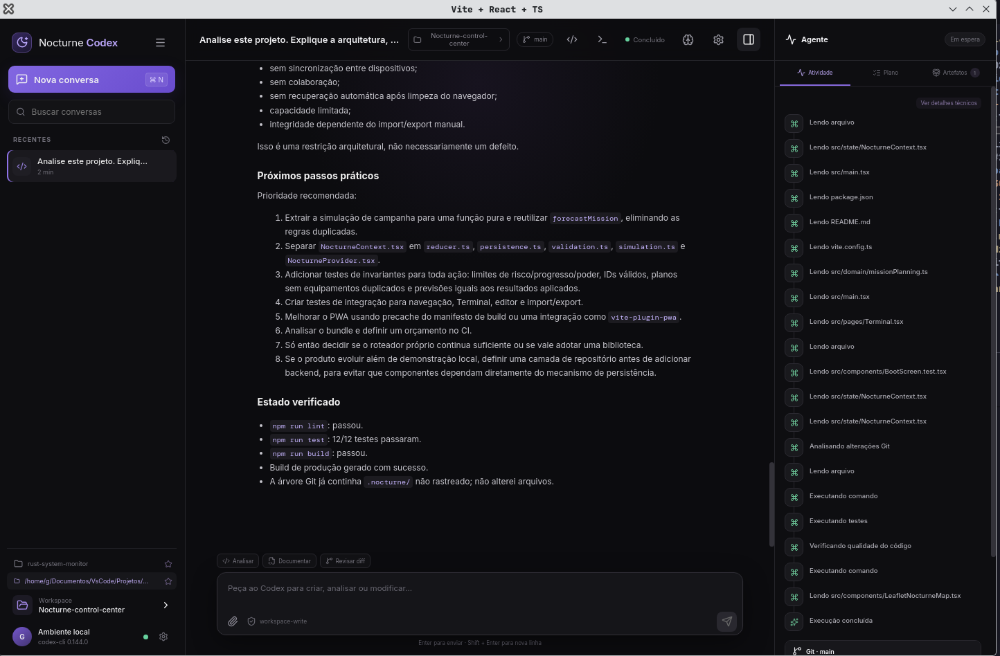
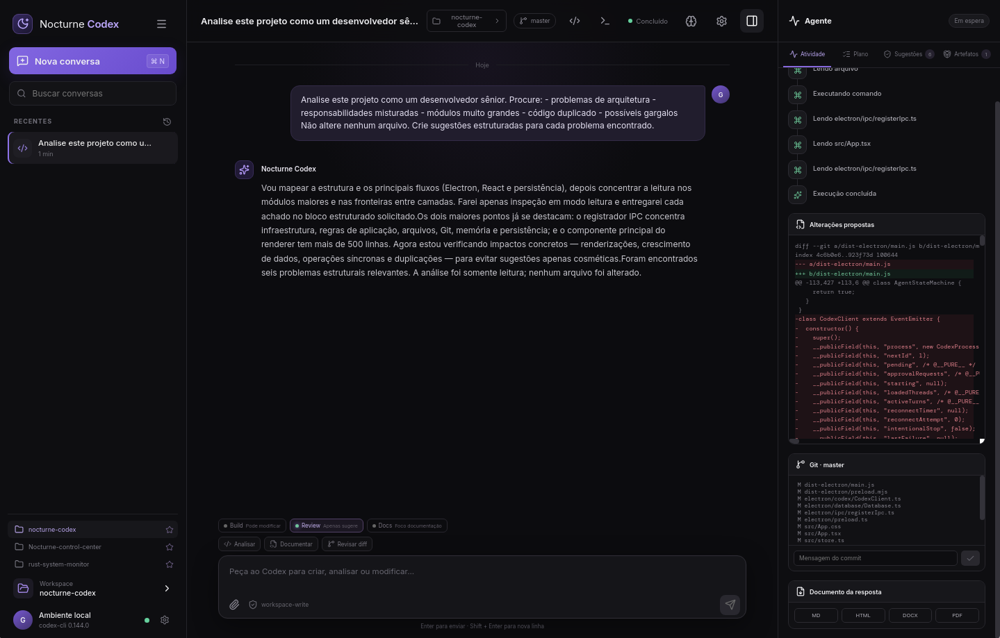
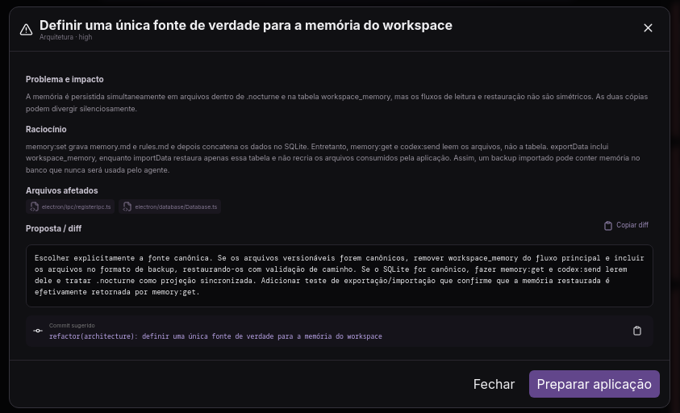

> The Nocturne Codex doesn't try to replace the developer. It organizes the collaboration between the developer and AI.

# Nocturne Codex

Nocturne Codex is a local desktop engineering workspace for working with the Codex CLI and App Server. It brings project context, persistent conversations, agent activity, review, planning, approvals, artifacts, and Git awareness into one place—without moving engineering decisions away from the developer.

The project is currently in **Beta** and under active development.

> Nocturne Codex is an independent open source project. It is not an official OpenAI product and is not affiliated with OpenAI.

---

## Philosophy

AI can inspect a codebase quickly, connect information across files, and propose changes at a useful scale. A developer still has to decide what belongs in the product, which trade-offs are acceptable, and whether a change is correct.

Nocturne Codex is built around that division of responsibility. The agent contributes analysis and implementation capacity; the developer retains intent, judgment, approval, and accountability.

The collaboration is organized as an explicit engineering loop:

```text
Analyze
   ↓
Plan
   ↓
Explain
   ↓
Suggest
   ↓
Approve
   ↓
Implement
   ↓
Validate
```

Not every analysis should become an edit. Not every suggestion should be accepted. Not every generated change should be committed. Nocturne Codex makes those boundaries visible instead of hiding them behind a single prompt box.

---

## What is Nocturne Codex?

Nocturne Codex is not only a chat window. A chat transcript alone does not explain what the agent is doing, preserve project decisions, or create a safe boundary around code changes.

It is not merely a graphical wrapper around the Codex CLI. It manages App Server lifecycle, JSON-RPC events, persistent threads, approvals, workspace context, diagnostics, and recovery behavior.

It is also not an IDE. It does not aim to replace source navigation, debugging, or the editor where developers already work.

Nocturne Codex is an **Engineering Workspace**: a desktop environment for coordinating a developer, an intelligent agent, and the state of a real software project. It sits beside the editor and repository, giving the collaboration structure and memory.

---

## Core capabilities

### Persistent AI conversations

Conversations and messages are stored locally in SQLite. Codex thread IDs are retained so a project discussion can continue across application sessions instead of starting from zero every time.

### Workspace management

Workspaces establish the project boundary. Recent and favorite projects are available from the interface, while file access, previews, attachments, and exports are validated against the selected workspace.

### Codex App Server integration

The application starts `codex app-server --stdio`, initializes the JSON-RPC session, creates or resumes threads, streams responses, routes approval requests, and supports turn cancellation. Unexpected process exits are detected and reported rather than presented as a ready state.

### Agent Activity

The activity panel translates low-level events into human-readable work such as reading a file, inspecting Git changes, running tests, or applying a patch. Technical output remains available when it is needed, but it is not the primary interface.

### Planning

Plans emitted by the agent are shown as ordered steps with progress. A plan can be reviewed and edited before it is executed, making larger tasks easier to inspect before code changes begin.

### Review Mode

Review Mode forces the turn into a read-only sandbox. The agent can inspect the project, run safe read-only checks, explain findings, and publish structured suggestions. It cannot edit the workspace simply because the user asked for an analysis.

### Build Mode

Build Mode is the execution-oriented mode. The agent may modify files within the configured workspace sandbox, subject to the App Server approval policy and the application's command safeguards. The resulting files and diff remain visible for review.

### Docs Mode

Docs Mode focuses the agent on documentation work and limits its instructions to documentation files related to the request. Markdown can be saved directly or exported through the document workflow.

### AI Suggestions

Review findings become persistent suggestions rather than disappearing into prose. A suggestion records the problem, impact, reasoning, affected files, proposed solution, expected benefits, severity, category, estimated complexity, and risk. The developer can inspect, reject, defer, or explicitly prepare it for application.

### Project Health

Project Health summarizes open suggestions across architecture, security, testing, performance, maintainability, and documentation. The scores are explicitly estimates: each explanation states which open suggestions and severity penalties contributed to the result. They are not presented as objective code-quality measurements.

### Workspace Memory

Each workspace can maintain:

```text
.nocturne/
├── project.json
├── memory.md
└── rules.md
```

Detected stack information, useful commands, architectural decisions, and project preferences are supplied as context in future turns. Accepted and rejected review decisions also become part of the project's durable memory.

### Artifacts

Responses, reports, diffs, files, images, Markdown, configuration, and exported documents can be retained as conversation artifacts. Text, Markdown, code, and supported images have an internal preview; files can also be opened in the system editor or containing folder.

### Git integration

Nocturne Codex shows the current branch, modified files, working and staged diffs, and confirmed commits. It does not push automatically. Commit creation requires user confirmation and currently stages the workspace with `git add -A`.

### Diagnostics and recovery

Structured, rotating logs record application, renderer, App Server, IPC, workspace, Git, export, and persistence failures without intentionally logging full file contents. The settings screen exposes process state, executable path, PID, version, last failure, log access, diagnostic copying, and App Server restart.

### Secure Electron architecture

The renderer runs with `contextIsolation: true`, `nodeIntegration: false`, and Electron sandboxing. Node.js, SQLite, filesystem, Git, Pandoc, and process management stay in the main process. The preload exposes a small named API, IPC inputs are validated with Zod, external navigation is restricted, and workspace paths are normalized before access.

---

## Screenshots

### Project analysis and agent activity



### Review Mode



### Suggestion details



---

## How it works

1. **Verify the local Codex environment.** On first launch, Nocturne Codex checks the CLI path, version, authentication status, and App Server availability.
2. **Select a workspace.** The workspace becomes the root for conversations, memory, file access, and agent operations.
3. **Start or resume a conversation.** Messages and the Codex thread are persisted locally.
4. **Choose the interaction mode.** Use Review for read-only analysis, Build for implementation, or Docs for documentation-focused work.
5. **Observe the work.** Streaming responses, agent state, activities, plans, approvals, changed files, and diffs are shown while the turn runs.
6. **Evaluate suggestions.** Review the evidence, impact, files, benefits, risk, complexity, and proposed diff before deciding what to do.
7. **Approve implementation deliberately.** Applying a suggestion creates an implementation request in Build Mode; opening a suggestion alone never changes a file.
8. **Validate the result.** Ask the agent to run relevant type checks, linting, and tests, then inspect the Git diff yourself.
9. **Preserve or export the outcome.** Keep artifacts in the conversation, update workspace memory, save Markdown, or export supported document formats.

---

## Review Mode

A request can be as simple as:

```text
Analyze my project.
```

In Review Mode, the agent may read source files, inspect architecture and Git state, run safe read-only commands, identify problems, explain their impact, and produce structured suggestions. Each proposal can include affected files and a concrete solution or diff.

Review Mode does **not** automatically edit files, install dependencies, remove files, or execute workspace modifications. The sandbox is forced to read-only for the turn, even if the general application setting allows workspace writes.

The output is therefore a decision surface, not an implicit implementation queue. Suggestions remain pending until the developer rejects them or explicitly moves one into the application flow.

See [docs/review-mode.md](docs/review-mode.md) for protocol and persistence details.

---

## Build Mode

Build Mode is used when the developer intends to change the project. The agent can inspect files, publish a plan, request approvals, modify files inside the workspace sandbox, and run validation commands.

The mode does not make generated changes correct by default. The developer is expected to inspect activities, review affected files and diffs, consider test output, and decide whether the result should be committed.

Dangerous or sensitive command patterns are classified by a central policy. App Server approvals remain part of the execution path, and destructive Git or privilege-escalation commands are not treated as routine operations.

---

## Docs Mode

Docs Mode narrows the agent's focus to documentation related to the request. It is suitable for architecture notes, setup guides, troubleshooting material, reports, and project documentation.

Markdown responses can be saved as `.md`. HTML, DOCX, and PDF export are available when Pandoc—and, for some PDF workflows, a compatible PDF engine—is installed on the system.

---

## Security model

Nocturne Codex reduces accidental authority; it does not claim to make arbitrary generated commands safe.

- The renderer has no direct Node.js access.
- Privileged operations are implemented in the Electron main process.
- IPC payloads are validated before use.
- File operations are confined to normalized workspace paths.
- Review Mode forces a read-only sandbox.
- Build operations follow the configured Codex sandbox and approval policy.
- Sensitive and dangerous commands are classified and surfaced for approval.
- External navigation is blocked inside the application; allowed HTTPS links open externally.
- The application reuses the Codex CLI's existing authentication. Credentials are not sent to the renderer.
- Logs are size-limited and redact fields that resemble tokens, passwords, API keys, or authorization data.

Review [docs/security.md](docs/security.md) and [SECURITY.md](SECURITY.md) before reporting or changing security-sensitive behavior.

---

## Installation

### Requirements

- Linux x64 for the currently packaged Beta builds;
- Codex CLI installed and authenticated;
- Codex CLI 0.144.0 ou superior com `app-server --stdio` (versão verificada: 0.144.1);
- Git for repository status, diff, and commit workflows;
- Pandoc only if HTML, DOCX, or PDF export is required.

Verify Codex before launching:

```bash
codex --version
codex login status
```

If authentication is missing, use the login flow provided by the Codex CLI:

```bash
codex login
```

Nocturne Codex starts and supervises the App Server automatically. It does not bundle the Codex CLI or copy the user's authentication into the application package.

### Linux AppImage

Download the AppImage from the GitHub Releases page, then:

```bash
chmod +x "Nocturne Codex-Linux-0.6.0-beta.AppImage"
./"Nocturne Codex-Linux-0.6.0-beta.AppImage"
```

A `.tar.gz` archive is also produced for the Beta release.

---

## Development

### Requirements

- Node.js 22 LTS;
- npm;
- a native build toolchain compatible with `better-sqlite3`;
- Codex CLI for manual App Server integration testing.

Install dependencies and start the development application:

```bash
npm install
npm run dev
```

For a lockfile-exact installation, use `npm ci` instead of `npm install`.

Available checks and builds:

```bash
npm run typecheck   # TypeScript validation
npm run lint        # ESLint
npm run test        # unit and integration tests using Electron's Node runtime
npm run test:watch  # watch mode with the same native ABI
npm run build       # renderer, main, and preload production builds
npm run package     # Linux AppImage and tar.gz
```

Tests use a simulated App Server transport and do not call the real Codex service. See [docs/development.md](docs/development.md) for native module and release notes.

---

## Roadmap

The following items are plans, not current capabilities.

### Short term

- [ ] End-to-end Electron tests for onboarding, review, approval, and recovery
- [ ] Signed release artifacts and published checksums
- [ ] Final screenshot set and accessibility pass
- [ ] Better diff navigation and per-file validation results
- [ ] Explicit App Server compatibility matrix

### Medium term

- [ ] Plugin system with a reviewed capability model
- [ ] More precise Git staging and application by hunk
- [ ] Reusable review profiles and workspace policies
- [ ] Better collaboration through exportable reviews and decision history
- [ ] Additional packaged platforms after repeatable release validation

### Long term

- [ ] Multi-agent workflows with visible responsibilities and handoffs
- [ ] Optional local-model integrations
- [ ] Team collaboration without weakening local workspace boundaries
- [ ] Extensible engineering workflows beyond the current Codex integration

The roadmap is deliberately subordinate to stability. Multi-agent execution, plugins, real-time team collaboration, and local models do **not** exist in the current Beta.

---

## Status

**Beta — active development.**

The core local workflow is implemented and packaged for Linux x64, but the project still relies on an experimental App Server interface. Packages are not yet signed, automatic updates are not implemented, and compatibility may change with future Codex CLI releases.

Project Health is an explained estimate derived from open suggestions, not a formal security or quality audit. AI suggestions can be incomplete or wrong and must be reviewed like any other proposed engineering change.

Known issues and release changes are tracked in [CHANGELOG.md](CHANGELOG.md).

---

## Contributing

Contributions are welcome when they preserve the project's central constraint: AI work should remain observable, scoped, and subject to developer judgment.

Before opening a pull request:

1. discuss substantial behavior changes in an issue;
2. keep the change focused and avoid unrelated refactors;
3. preserve the Electron trust boundary and IPC validation;
4. use strict TypeScript types and follow the existing naming style;
5. add tests for state, persistence, security policy, or protocol behavior where relevant;
6. run typecheck, lint, tests, and build;
7. document manual validation and include screenshots for UI changes.

```bash
npm run typecheck
npm run lint
npm run test
npm run build
```

Read [CONTRIBUTING.md](CONTRIBUTING.md) and [CODE_OF_CONDUCT.md](CODE_OF_CONDUCT.md) before contributing. Security reports must follow [SECURITY.md](SECURITY.md) rather than public issues.

---

## License

Nocturne Codex is available under the [MIT License](LICENSE).
