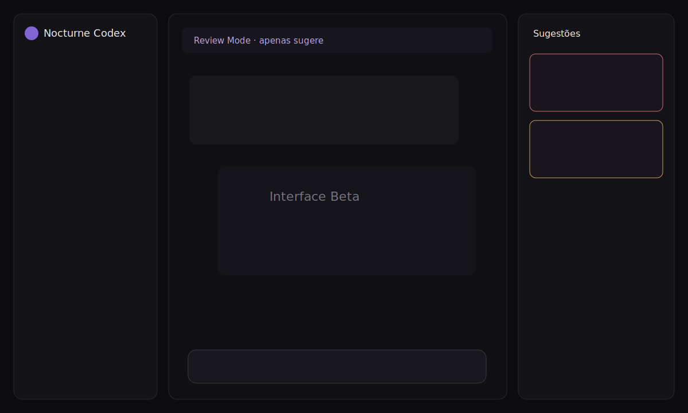

# Nocturne Codex

> Um cliente desktop local, independente e orientado a revisão para o Codex CLI.

Nocturne Codex reúne conversas, contexto de projeto, execução assistida e revisão estruturada em uma interface desktop. A filosofia é simples: compreender antes de modificar, deixar permissões visíveis e manter o usuário responsável por cada mudança importante.

O projeto não é afiliado à OpenAI e não é um produto oficial. Ele usa o Codex CLI instalado e autenticado no computador do usuário; tokens não são solicitados nem distribuídos pelo aplicativo.



## Destaques

- Review Mode somente leitura com sugestões estruturadas;
- Build Mode para alterações confirmadas e validação;
- Docs Mode focado em documentação;
- threads reais do Codex App Server com streaming e cancelamento;
- workspaces, memória durável e regras em `.nocturne/`;
- atividades humanas, planos, artefatos e preview seguro;
- Project Health estimado a partir de evidências abertas;
- Git status, diff e commits confirmados, nunca automáticos;
- exportação Markdown, HTML, DOCX e PDF;
- SQLite versionado, backup, logs rotativos e diagnóstico.

## Requisitos

- Linux x64 para os pacotes Beta atuais;
- Node.js 22 LTS e npm para desenvolvimento;
- Codex CLI instalado e autenticado;
- Pandoc opcional para HTML/DOCX/PDF.

Confirme o ambiente:

```bash
codex --version
codex login status
```

## Instalação

Baixe o AppImage ou tar.gz na página de Releases. Para AppImage:

```bash
chmod +x "Nocturne Codex-Linux-0.5.0-beta.AppImage"
./"Nocturne Codex-Linux-0.5.0-beta.AppImage"
```

Para desenvolvimento:

```bash
git clone <url-do-repositorio>
cd nocturne-codex
npm ci
npm run dev
```

## Como usar

1. Conclua a verificação inicial do Codex CLI e login.
2. Escolha um workspace.
3. Use **Review** para analisar sem modificar arquivos.
4. Abra as sugestões e avalie impacto, risco e solução.
5. Confirme uma sugestão para executá-la em **Build**.
6. Revise o diff Git e crie um commit apenas quando estiver satisfeito.

## Arquitetura

O renderer React não acessa Node.js. O preload expõe uma API pequena; o processo principal valida IPC, gerencia SQLite/filesystem/Git e controla `codex app-server --stdio`. Review Mode força sandbox somente leitura no turno.

Detalhes: [arquitetura](docs/architecture.md), [agente](docs/agent.md), [Review Mode](docs/review-mode.md) e [workspaces](docs/workspace.md).

## Scripts

```bash
npm run typecheck
npm run lint
npm test
npm run build
npm run package
```

Os testes usam o runtime Node do Electron para não recompilar addons nativos enquanto a aplicação está aberta.

## Limitações da Beta

- integração do App Server ainda acompanha uma API experimental;
- pacotes assinados e atualização automática ainda não existem;
- PDF depende de ferramentas externas compatíveis com Pandoc;
- notas de Project Health são estimativas explicadas, não auditorias formais;
- sugestões dependem da saída estruturada do modelo;
- pacotes Linux usam temporariamente o ícone padrão do Electron.

## Roadmap

Consulte [docs/roadmap.md](docs/roadmap.md).

## Contribuição e segurança

Leia [CONTRIBUTING.md](CONTRIBUTING.md), [CODE_OF_CONDUCT.md](CODE_OF_CONDUCT.md) e [SECURITY.md](SECURITY.md). Não publique vulnerabilidades em issues públicas.

## Licença

MIT — consulte [LICENSE](LICENSE).
